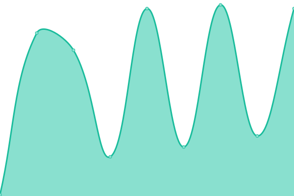

# [📈 Live Status](https://GavinDR1.github.io/Monitor): <!--live status--> **🟧 Partial outage**

This repository contains the open-source uptime monitor and status page for [GavinDR1](https://GavinDR1.github.io/Monitor), powered by [Upptime](https://github.com/upptime/upptime).

With [Upptime](https://upptime.js.org), you can get your own unlimited and free uptime monitor and status page, powered entirely by a GitHub repository. We use [Issues](https://github.com/GavinDR1/Monitor/issues) as incident reports, [Actions](https://github.com/GavinDR1/Monitor/actions) as uptime monitors, and [Pages](https://GavinDR1.github.io/Monitor) for the status page.

<!--start: status pages-->
<!-- This summary is generated by Upptime (https://github.com/upptime/upptime) -->
<!-- Do not edit this manually, your changes will be overwritten -->
<!-- prettier-ignore -->
| URL | Status | History | Response Time | Uptime |
| --- | ------ | ------- | ------------- | ------ |
|  Drip Server | 🟥 Down | [drip-server.yml](https://github.com/GavinDR1/Monitor/commits/HEAD/history/drip-server.yml) | 

 0ms
     
 | 

<a href="https://GavinDR1.github.io/Monitor/history/drip-server">0.00%</a>
    

|  [ModMail](https://modmailbot.gavindr1.repl.co) | 🟥 Down | [mod-mail.yml](https://github.com/GavinDR1/Monitor/commits/HEAD/history/mod-mail.yml) | 

 337ms
     
 | 

<a href="https://GavinDR1.github.io/Monitor/history/mod-mail">100.00%</a>
    

|  [Countr](https://darkamusingcomputeranimation.gavindr1.repl.co) | 🟩 Up | [countr.yml](https://github.com/GavinDR1/Monitor/commits/HEAD/history/countr.yml) | 

 6275ms
     
 | 

<a href="https://GavinDR1.github.io/Monitor/history/countr">99.03%</a>
    

<!--end: status pages-->

[**Visit our status website →**](https://GavinDR1.github.io/Monitor)

## 📄 License

- Powered by: [Upptime](https://github.com/upptime/upptime)
- Code: [MIT](./LICENSE) © [GavinDR1](https://GavinDR1.github.io/Monitor)
- Data in the `./history` directory: [Open Database License](https://opendatacommons.org/licenses/odbl/1-0/)
